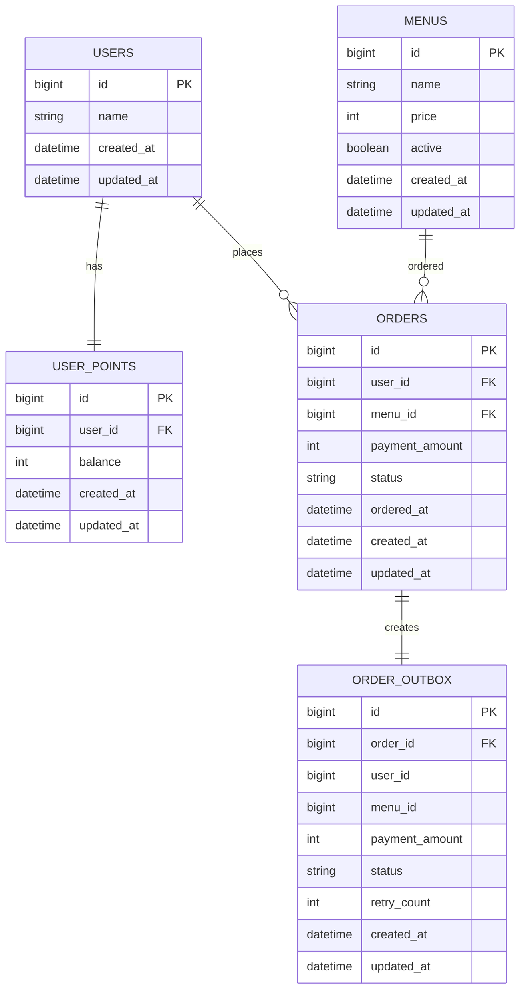

# 커피숍 주문 시스템 설계 문서

## 0. 문제 해결 전략 수립

### 0-1. 과제 해석

이 과제는 단순히 커피 메뉴를 조회하고 주문하는 API를 구현하는 것보다, 다수의 서버 인스턴스 환경에서도 주문과 결제 데이터가 안정적으로 유지되는 구조를 설계하는 것이 핵심이다.

특히 포인트 결제는 사용자의 잔액을 기준으로 성공 여부가 결정되기 때문에, 동시 요청 상황에서 데이터 불일치가 발생하지 않도록 설계해야 한다.

따라서 본 과제에서는 기능을 다음과 같이 구분한다.

- 강한 일관성이 필요한 기능: 포인트 충전, 포인트 차감, 주문 생성
- 정확한 집계가 필요한 기능: 최근 7일 인기 메뉴 조회
- 외부 시스템과 연동되는 기능: 주문 내역 데이터 플랫폼 전송
- 읽기 중심 기능: 커피 메뉴 목록 조회

핵심 전략은 주문/결제 영역에는 DB 트랜잭션과 락을 사용하여 정합성을 보장하고, 외부 전송과 인기 메뉴 조회는 확장 가능성을 고려해 분리 설계하는 것이다.

### 0-2. 핵심 설계 목표

1. 동일 사용자의 동시 주문 요청에서도 포인트 잔액이 음수가 되지 않아야 한다.
2. 포인트 차감과 주문 생성은 하나의 트랜잭션으로 처리되어야 한다.
3. 주문 성공 이후 데이터 플랫폼 전송 이벤트가 유실되지 않아야 한다.
4. 인기 메뉴는 최근 7일간의 주문 데이터를 기준으로 정확하게 집계되어야 한다.
5. 다수의 애플리케이션 인스턴스가 떠 있어도 DB 기준의 락과 트랜잭션으로 일관성을 보장해야 한다.

## 1. 설계 의도

### 1-1. 기능별 일관성 수준 분리

모든 기능에 동일한 수준의 일관성 전략을 적용하지 않는다. 기능의 성격에 따라 필요한 일관성 수준을 분리한다.

주문/결제는 사용자의 포인트 잔액을 변경하고 주문 데이터를 생성하기 때문에 강한 일관성이 필요하다. 따라서 DB 트랜잭션과 비관적 락을 사용한다.

메뉴 조회는 읽기 중심 기능이며 메뉴 데이터의 변경 빈도가 낮으므로, 초기에는 DB 조회로 구현하고 필요 시 캐시를 적용할 수 있도록 설계한다.

인기 메뉴 조회는 최근 7일간의 주문 횟수가 정확해야 하므로, 초기 구현에서는 원천 데이터인 주문 테이블을 기준으로 집계한다. 이후 트래픽이 증가하면 Redis Sorted Set 또는 일별 집계 테이블을 사용할 수 있다.

외부 데이터 플랫폼 전송은 주문/결제 성공 이후의 부가 처리이다. 외부 시스템 장애가 주문/결제 정합성에 영향을 주지 않도록 Outbox 패턴으로 분리한다.

### 1-2. 최종 설계 방향

- 주문/결제: DB 트랜잭션 + 사용자 포인트 row 비관적 락
- 외부 데이터 플랫폼 전송: Outbox 패턴
- 인기 메뉴: 초기 구현은 orders 테이블 기준 최근 7일 집계
- 인기 메뉴 확장안: Redis Sorted Set 또는 일별 집계 테이블
- 메뉴 조회: DB 조회 후 필요 시 캐시 적용

## 2. ERD



### 2-1. 테이블 설명

| 테이블 | 설명 |
| --- | --- |
| users | 사용자 정보 |
| menus | 커피 메뉴 정보 |
| user_points | 사용자 포인트 잔액 |
| orders | 주문/결제 내역 |
| order_outbox | 데이터 플랫폼 전송 대상 이벤트 |

### 2-2. 테이블 설계 의도

사용자의 포인트 잔액은 `users`와 분리하여 `user_points`에 저장한다. 포인트 row는 주문/결제 시 비관적 락의 대상이 된다.

주문 데이터는 `orders`에 저장한다. 인기 메뉴 조회는 이 주문 데이터를 기준으로 최근 7일간 메뉴별 주문 횟수를 집계한다.

데이터 플랫폼으로 전송해야 하는 주문 이벤트는 `order_outbox`에 저장한다. 주문 생성과 outbox 저장을 같은 트랜잭션으로 처리하여 주문 이벤트 유실을 방지한다.

## 3. API 명세

### 3-1. 커피 메뉴 목록 조회 API

```http
GET /api/menus
```

#### Response

```json
{
  "menus": [
    {
      "id": 1,
      "name": "Americano",
      "price": 3000
    },
    {
      "id": 2,
      "name": "Latte",
      "price": 4500
    }
  ]
}
```

#### 설명

활성화된 커피 메뉴 목록을 조회한다.

메뉴 데이터는 변경 빈도가 낮기 때문에 초기 구현은 DB 조회로 처리하고, 트래픽이 증가하면 캐시를 적용할 수 있다.

### 3-2. 포인트 충전 API

```http
POST /api/users/{userId}/points/charge
```

#### Request

```json
{
  "amount": 10000
}
```

#### Response

```json
{
  "userId": 1,
  "chargedAmount": 10000,
  "balance": 15000
}
```

#### 설명

사용자 식별값과 충전 금액을 받아 포인트를 충전한다. 1원은 1P로 계산한다.

충전 금액은 0보다 커야 한다.

### 3-3. 커피 주문/결제 API

```http
POST /api/orders
```

#### Request

```json
{
  "userId": 1,
  "menuId": 2
}
```

#### Response

```json
{
  "orderId": 10,
  "userId": 1,
  "menuId": 2,
  "paymentAmount": 4500,
  "remainingPoint": 5500,
  "status": "PAID"
}
```

#### 설명

사용자 식별값과 메뉴 ID를 받아 주문과 결제를 처리한다.

결제는 포인트로만 가능하며, 주문 금액만큼 사용자 포인트에서 차감한다.

동시 결제 요청에 대비해 사용자 포인트 row에 비관적 락을 적용한다.

주문 성공 시 주문 내역을 데이터 플랫폼으로 전송해야 하므로, 같은 트랜잭션 안에서 outbox 이벤트를 저장한다.

### 3-4. 인기 메뉴 목록 조회 API

```http
GET /api/menus/popular
```

#### 조회 기준

- 기간: 최근 7일
- 개수: 상위 3개
- 기준: 주문 수 내림차순

#### Response

```json
{
  "popularMenus": [
    {
      "menuId": 2,
      "name": "Latte",
      "price": 4500,
      "orderCount": 15
    },
    {
      "menuId": 1,
      "name": "Americano",
      "price": 3000,
      "orderCount": 12
    },
    {
      "menuId": 3,
      "name": "Mocha",
      "price": 5000,
      "orderCount": 8
    }
  ]
}
```

#### 설명

최근 7일간 주문 수가 많은 메뉴 3개를 조회한다.

정확성이 중요하므로 초기 구현은 `orders` 테이블을 기준으로 집계한다.

## 4. 동시성 전략

### 4-1. 발생 가능한 문제

동일 사용자가 동시에 주문을 요청하면 두 요청이 같은 포인트 잔액을 읽고 모두 결제를 성공시킬 수 있다.

예를 들어 현재 잔액이 5,000P이고 메뉴 가격이 4,500P일 때, 동시에 두 개의 주문 요청이 들어오면 실제로는 하나의 주문만 성공해야 한다.

하지만 락 없이 처리하면 두 요청이 모두 잔액 5,000P를 읽고 결제를 진행할 수 있다. 이 경우 포인트 잔액이 음수가 되거나, 실제 잔액과 주문 내역이 일치하지 않는 문제가 발생한다.

### 4-2. 선택한 해결 전략: 비관적 락

주문 결제 시 사용자 포인트 row에 비관적 락을 적용한다.

```sql
SELECT *
FROM user_points
WHERE user_id = ?
FOR UPDATE;
```

락을 획득한 요청만 잔액 검증과 차감을 수행할 수 있다. 다른 요청은 먼저 들어온 트랜잭션이 끝날 때까지 대기한다.

### 4-3. 선택 이유

비관적 락을 선택한 이유는 다음과 같다.

- 포인트 결제는 잔액 정확성이 가장 중요하다.
- 동일 사용자의 결제 요청은 순차 처리되는 것이 자연스럽다.
- DB 락은 애플리케이션 서버가 여러 대여도 동일하게 적용된다.
- 구현과 테스트가 명확하다.
- Redis 분산락보다 운영 복잡도가 낮다.

### 4-4. 대안 비교

| 방식 | 장점 | 단점 | 판단 |
| --- | --- | --- | --- |
| 비관적 락 | 정합성 보장 명확, 다중 서버에서도 동작 | 같은 사용자 요청은 대기 발생 | 선택 |
| 낙관적 락 | 락 대기 시간이 적음 | 충돌 시 재시도 로직 필요 | 대안 |
| Redis 분산락 | DB 부하를 줄일 수 있음 | 락 만료, 장애 상황 고려 필요 | 과제 범위에서는 과함 |
| synchronized | 구현 단순 | 서버가 여러 대면 동작하지 않음 | 제외 |

## 5. 데이터 일관성 전략

### 5-1. 트랜잭션 범위

주문/결제 API는 다음 작업을 하나의 트랜잭션으로 처리한다.

1. 메뉴 조회
2. 사용자 포인트 조회 및 락 획득
3. 잔액 검증
4. 포인트 차감
5. 주문 생성
6. outbox 이벤트 저장

이 중 하나라도 실패하면 전체 트랜잭션을 rollback한다.

### 5-2. 보장하려는 일관성

다음 상황이 발생하지 않도록 한다.

- 포인트만 차감되고 주문이 없는 상태
- 주문은 생성됐지만 포인트가 차감되지 않은 상태
- 주문은 생성됐지만 데이터 플랫폼 전송 이벤트가 기록되지 않은 상태
- 잔액보다 큰 금액이 결제되는 상태

### 5-3. Outbox 패턴

주문 내역을 데이터 플랫폼으로 실시간 전송해야 하지만, 외부 API 호출을 주문 트랜잭션 안에서 직접 처리하지 않는다.

외부 API는 네트워크 장애, timeout, 일시적 실패가 발생할 수 있다. 외부 전송 실패 때문에 주문/결제 트랜잭션 전체가 실패하면 사용자 경험과 시스템 안정성이 나빠진다.

따라서 주문 성공 시 같은 트랜잭션 안에서 `order_outbox` 테이블에 전송 이벤트를 저장한다.

트랜잭션이 성공하면 별도 worker 또는 scheduler가 outbox 데이터를 읽어 데이터 플랫폼으로 전송한다.

```text
주문 트랜잭션:
포인트 차감
주문 생성
outbox 저장

트랜잭션 이후:
outbox 조회
데이터 플랫폼 전송
성공 시 SENT 처리
실패 시 retry_count 증가
```

### 5-4. Outbox 선택 이유

- 주문과 전송 이벤트 저장을 하나의 트랜잭션으로 묶을 수 있다.
- 외부 플랫폼 장애가 주문/결제 정합성을 깨지 않는다.
- 실패한 전송을 재시도할 수 있다.
- 이벤트 유실 가능성을 줄일 수 있다.
- 추후 Kafka, RabbitMQ 같은 메시지 큐로 확장하기 쉽다.

## 6. 확장성 전략

### 6-1. 다중 서버 환경

여러 개의 애플리케이션 인스턴스가 동시에 실행되어도 핵심 정합성은 DB 기준으로 보장한다.

포인트 결제의 동시성 제어를 애플리케이션 메모리가 아니라 DB row lock으로 처리하기 때문에, 서버 인스턴스가 여러 대여도 같은 사용자 포인트에 대한 동시 결제는 순차적으로 처리된다.

`synchronized` 같은 JVM 내부 락은 단일 서버에서는 동작하지만, 다중 서버 환경에서는 각 서버마다 락이 따로 존재하므로 사용하지 않는다.

### 6-2. 메뉴 조회 확장

메뉴 목록은 변경 빈도가 낮고 조회 빈도가 높을 수 있다.

초기 구현은 DB 조회로 처리하고, 트래픽이 증가하면 다음 방식으로 확장할 수 있다.

- 애플리케이션 캐시
- Redis 캐시
- 메뉴 변경 시 캐시 무효화

### 6-3. 인기 메뉴 조회 확장

초기 구현은 정확성을 우선하여 `orders` 테이블을 직접 집계한다.

```sql
SELECT menu_id, COUNT(*) AS order_count
FROM orders
WHERE ordered_at >= NOW() - INTERVAL '7 DAYS'
GROUP BY menu_id
ORDER BY order_count DESC
LIMIT 3;
```

이 방식은 원천 데이터 기준이라 정확하다.

다만 주문 데이터가 많아질 경우 매번 `orders` 테이블을 집계하는 비용이 커질 수 있다. 이 경우 확장 전략으로 Redis Sorted Set 또는 일별 집계 테이블을 사용할 수 있다.

#### Redis Sorted Set 확장안

주문 성공 시 날짜별 Sorted Set에 메뉴 주문 수를 증가시킨다.

```text
popular:menus:2026-07-08
menuId 1 -> score 10
menuId 2 -> score 15
```

최근 7일 인기 메뉴를 조회할 때는 최근 7일치 key를 합산해 TOP 3를 구한다.

Redis를 사용할 경우 조회 속도는 빨라지지만, Redis 데이터는 파생 데이터로 본다. 정확성의 기준은 `orders` 테이블이며, Redis 장애나 데이터 불일치가 발생하면 `orders` 테이블을 기준으로 재생성할 수 있어야 한다.

#### 일별 집계 테이블 확장안

```text
menu_daily_stats
- stat_date
- menu_id
- order_count
```

주문 성공 시 해당 날짜와 메뉴의 주문 수를 증가시킨다.

최근 7일 인기 메뉴는 이 집계 테이블을 기준으로 조회한다.

DB 안에서 관리되므로 Redis보다 정합성 설명이 쉽지만, 쓰기 시 집계 row update가 추가된다.

### 6-4. 데이터 플랫폼 전송 확장

초기 구현은 scheduler가 `order_outbox` 테이블을 주기적으로 조회해 전송한다.

트래픽이 증가하면 다음 구조로 확장할 수 있다.

```text
order_outbox -> message queue -> consumer workers -> data platform
```

이 구조를 사용하면 전송 worker를 여러 개로 늘려 처리량을 높일 수 있다.

## 7. 기술적 선택 이유

### 7-1. DB 트랜잭션

포인트 차감과 주문 생성은 반드시 함께 성공하거나 함께 실패해야 하므로 DB 트랜잭션을 사용한다.

### 7-2. 비관적 락

동일 사용자의 동시 결제 요청에서 잔액 불일치를 막기 위해 사용자 포인트 row에 비관적 락을 적용한다.

포인트 결제는 충돌 가능성이 낮더라도 실패 시 영향이 크기 때문에, 명확한 정합성을 우선한다.

### 7-3. Outbox 패턴

외부 데이터 플랫폼 전송은 네트워크나 외부 시스템 상태에 영향을 받는다.

주문 트랜잭션 안에서 외부 API를 직접 호출하면 외부 장애가 주문 실패로 이어질 수 있다. 따라서 outbox에 전송 이벤트를 저장하고, 트랜잭션 이후 별도 프로세스가 전송하도록 분리한다.

### 7-4. 주문 테이블 기준 인기 메뉴 집계

인기 메뉴는 최근 7일간 주문 횟수가 정확해야 하므로 원천 데이터인 `orders` 테이블을 기준으로 집계한다.

Redis나 집계 테이블은 조회 성능 개선을 위한 확장안으로 둔다.

## 8. 테스트 전략

### 8-1. 메뉴 조회 테스트

- 활성화된 메뉴 목록이 조회되는지 검증
- 비활성화된 메뉴가 제외되는지 검증

### 8-2. 포인트 충전 테스트

- 포인트 충전 성공
- 0 이하 금액 충전 실패
- 충전 후 잔액 증가 검증

### 8-3. 주문/결제 테스트

- 포인트가 충분하면 주문 성공
- 포인트가 부족하면 주문 실패
- 존재하지 않는 메뉴 주문 실패
- 주문 성공 시 포인트 차감 검증
- 주문 성공 시 orders 저장 검증
- 주문 성공 시 order_outbox 저장 검증

### 8-4. 동시성 테스트

- 동일 사용자가 동시에 여러 주문을 요청해도 잔액이 음수가 되지 않는지 검증
- 포인트가 한 번의 주문만 가능한 상태에서 동시 주문을 보냈을 때 하나만 성공하는지 검증

### 8-5. 인기 메뉴 테스트

- 최근 7일간 주문 수 기준으로 상위 3개 메뉴가 조회되는지 검증
- 7일 이전 주문은 집계에서 제외되는지 검증
- 주문 수가 같은 경우 정렬 기준을 검증

### 8-6. Outbox 테스트

- 주문 성공 시 outbox 이벤트가 저장되는지 검증
- 전송 성공 시 outbox 상태가 SENT로 변경되는지 검증
- 전송 실패 시 retry_count가 증가하는지 검증

## 9. 최종 설계 요약

본 시스템은 포인트 기반 커피 주문 시스템이다.

주문/결제는 데이터 정합성이 가장 중요하므로 DB 트랜잭션과 비관적 락을 사용한다.

동일 사용자의 포인트 row를 잠근 상태에서 잔액 검증과 차감을 수행하여, 다중 서버 환경에서도 중복 결제와 잔액 불일치를 방지한다.

주문 생성과 포인트 차감은 하나의 트랜잭션으로 묶어 함께 성공하거나 함께 실패하도록 처리한다.

주문 내역의 데이터 플랫폼 전송은 Outbox 패턴을 사용한다. 주문 트랜잭션 안에서는 전송 이벤트만 저장하고, 실제 외부 전송은 별도 worker 또는 scheduler가 처리한다. 이를 통해 외부 시스템 장애가 주문/결제 정합성에 영향을 주지 않도록 한다.

인기 메뉴는 정확성을 우선하여 `orders` 테이블의 최근 7일 주문 데이터를 기준으로 집계한다. 트래픽 증가 시 Redis Sorted Set 또는 일별 집계 테이블을 활용해 조회 성능을 개선할 수 있으며, 이 경우에도 `orders` 테이블을 원천 데이터로 유지한다.
